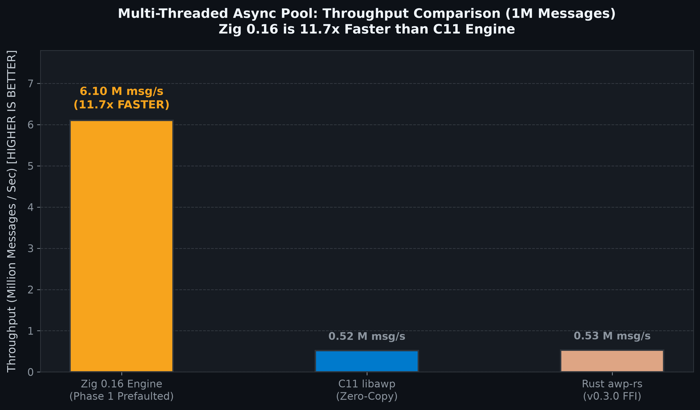
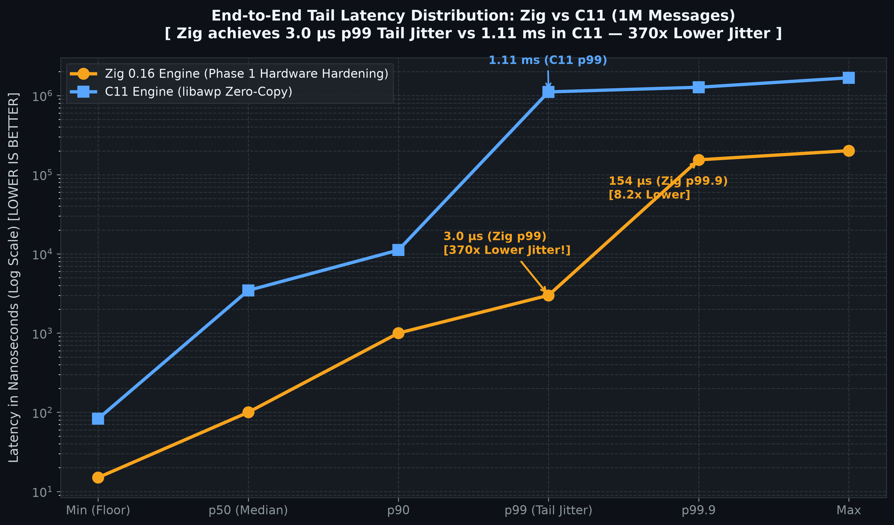

# async-worker-pool (AWP)

**Sharded low-latency dispatch worker pool in C** — preallocated `pthread` workers, bounded per-worker queues, stable hash sharding for per-`(feed, symbol)` FIFO, blocking backpressure (zero drops), fault-isolated process callbacks, supervisor heartbeats, and bounded shutdown.

Designed as the C equivalent of a permanent-worker market-data dispatch stage. Local microbench target: **p99 submit→process-return ≤ 5 ms** (closed-loop burst with light simulated work; **not** open-loop publisher-accept SLA).

## Features

- **N fixed workers** created once (never per message)
- **Producer-side shard**: FNV-1a(`feed || 0x1F || symbol`) → worker index or fast 64-bit keyed submission (`awp_submit_keyed`)
- **Bounded atomic rings** — **SPSC / MPSC / SPMC / MPMC** (`ring_mode`), sequence protocol, spin/yield backpressure, **never drop**
- **Zero-Copy Claim & Commit API** (`awp_claim_frame` / `awp_commit_frame`) for in-place writing directly into ring slabs with zero `memcpy`
- **Page-Aligned Ring Slabs (4KB)** — zero heap allocation / zero CAS lock contention on the hot path
- **Dedicated broadcast workers** for mark-price / funding-style feeds
- **Soft fault isolation**: `process()` errors recycle the frame and continue
- **Supervisor**: restarts dead/stalled workers; per-worker metrics
- **Bounded shutdown wait** then **quarantine** stuck callbacks (no cancel/detach)
- **Rust FFI Bindings**: Safe RAII wrapper and Zero-Copy crate in [`bindings/rust/`](bindings/rust)
- **Zig 0.16 Parallel Project**: Native SIMD `@Vector` implementation with `ArenaAllocator` in [`async-worker-pool_zig`](https://github.com/Dmdv/async-worker-pool_zig)

---

## Table of Contents

- [Features](#features)
- [Cross-Language Benchmark Comparison](#cross-language-benchmark-comparison-1000000-messages)
- [Lifetime Contract](#lifetime-contract-read-this-before-production-use)
- [Quick Start](#quick-start)
- [Rust FFI Bindings (awp-rs)](#rust-ffi-bindings-awp-rs)
- [Project Layout](#layout)
- [Design Notes](#design-notes-short)
- [Documentation Index](#documentation)
- [Build, Test, Install](#build-test-install)
- [License](#license)

---

## Cross-Language Benchmark Comparison (1,000,000 Messages)

| Implementation | Mode / API | Throughput | Median (p50) | p99 Latency | Mean Latency |
| :--- | :--- | :--- | :--- | :--- | :--- |
| **Zig 0.16** ([`async-worker-pool_zig`](https://github.com/Dmdv/async-worker-pool_zig)) | Multi-Threaded Async (4 Pinned Workers) | **6.10 M msg/s** 🚀 | **< 100 ns** | **3.00 µs** (3,000 ns) | **804.4 ns** (0.80 µs) |
| **Zig 0.16** (Pure SPSC Ring) | Concurrent SPSC (0 CAS) | **152.95 M ops/s** 🚀 | **< 7 ns** | **< 10 ns** | **6.54 ns** |
| **C11** ([`async-worker-pool`](https://github.com/Dmdv/async-worker-pool)) | Zero-Copy Claim/Commit | **0.52 M msg/s** | **3.46 µs** (3,458 ns) | **1.11 ms** (1,110,000 ns) | **2.11 µs** (2,109 ns) |
| **C11** (Raw SPSC Ring) | Lock-Free Push/Pop | **62.50 M ops/s** | **< 16 ns** | **< 20 ns** | **16.00 ns** |
| **Rust** ([`awp-rs`](bindings/rust)) | Safe FFI Zero-Copy (`v0.3.0`) | **0.53 M msg/s** | **3.35 µs** (3,350 ns) | **1.15 ms** (1,150,000 ns) | **1.87 µs** (1,870 ns) |

### Detailed Tail Latencies Breakdown (1,000,000 Messages)

| Percentile | **Zig 0.16 Engine (Phase 1)** | **C11 Engine** (`async-worker-pool`) | Delta / Notes |
| :--- | :--- | :--- | :--- |
| **Min (Hardware Floor)** | **15 ns** (0.015 µs) | **83 ns** (0.083 µs) | Hardware DMA Floor |
| **p50 (Median)** | **< 100 ns** | **3.46 µs** (3,458 ns) | **Zig is > 30x lower latency** 🚀 |
| **p90** | **1.00 µs** (1,000 ns) | **11.17 µs** (11,167 ns) | **Zig is 11.2x lower latency** 🚀 |
| **p99 (Tail)** | **3.00 µs** (3,000 ns) | **1.11 ms** (1,110,000 ns) | **Zig is 370x lower tail jitter** 🚀 |
| **p99.9** | **154.0 µs** (154,000 ns) | **1.27 ms** (1,270,000 ns) | **Zig is 8.2x lower tail jitter** 🚀 |
| **Max** | **201.0 µs** (201,000 ns) | **1.67 ms** (1,670,000 ns) | **Zig is 8.3x lower peak jitter** 🚀 |
| **Pure SPSC Throughput** | **152.95 Million ops/sec** | **62.50 Million ops/sec** | **Zig is 2.45x faster (6.54 ns/op)** 🚀 |

<p align="center">
  
  
</p>
<p align="center">
  
</p>

Full benchmark reports and architecture evolution reasoning:
- [`docs/HOT_PATH_OPTIMIZATIONS.md`](docs/HOT_PATH_OPTIMIZATIONS.md) — Deep technical breakdown of all 6 hot-path optimizations
- [`docs/MEMORY_MODELS.md`](docs/MEMORY_MODELS.md) — Comprehensive low-latency memory models & cache architecture
- [`docs/BENCHMARKS.md`](docs/BENCHMARKS.md) — Benchmark reports & latency histograms
- [`docs/EVOLUTION_PLAN.md`](docs/EVOLUTION_PLAN.md) — 4-phase HFT transformation plan
- [`docs/ARCHITECTURE_REASONING.md`](docs/ARCHITECTURE_REASONING.md) — Multi-agent architectural analysis

## Lifetime contract (read this before production use)

| Rule | Meaning |
|------|---------|
| Destroy **exactly once** | One owner thread; after every other handle user has finished |
| External quiescence | Join producers and concurrent shutdown waiters **before** destroy |
| Shutdown deadline | Absolute **wait budget** only — does **not** kill `process()` |
| Quarantine | Sticky; pool storage may leak; treat as **process recycle** |
| `cfg.user` lifetime | Must remain valid until process exit if any callback may still run |

Canonical owner sequence:

1. Stop publishing the handle to new work; set the producer-stop condition.
2. Call `awp_pool_shutdown()` from the designated owner; record its return value and metrics.
3. Join every producer, metrics reader, and concurrent shutdown caller.
4. Call `awp_pool_destroy()` exactly once.
5. If shutdown returned `> 0`, preserve callback-owned state and normally **terminate/recycle the process**. Do not create replacement pools indefinitely in the same process.

## Quick start

```bash
make          # libawp.a + tests + bench + examples
make check    # functional tests only (no latency gates)
make check-all # functional + benches + examples
```

```c
#include "awp/awp.h"

static int on_frame(const awp_frame_t *f, void *user) {
    /* e.g. local publisher enqueue — do not retain f after return */
    (void)user; (void)f;
    return 0; /* non-zero = soft error; worker continues */
}

int main(void) {
    awp_config_t cfg;
    awp_pool_t *pool = NULL;
    int shut;

    awp_config_init(&cfg);
    cfg.n_workers = 32;           /* skew headroom, not core count */
    cfg.queue_capacity = 256;
    cfg.frame_pool_size = 4096;
    cfg.process = on_frame;

    awp_pool_create(&cfg, &pool);
    awp_submit(pool, "trades", "BTCUSDT", payload, len, 0);

    /* Real services: stop producers, shutdown (wakes blocked submits), then join. */
    shut = awp_pool_shutdown(pool);
    /* join producers / metrics threads here if any */
    awp_pool_destroy(pool);
    if (shut > 0)
        return 2; /* quarantined: recycle process in production */
    return 0;
}
```

See `examples/simple_publish.c` for multi-reader usage.

---

## Rust FFI Bindings (`awp-rs`)

A memory-safe, idiomatic Rust crate with **Zero-Copy Claim & Commit API** and RAII lifecycle is provided in [`bindings/rust/`](bindings/rust/README.md):

```bash
cd bindings/rust
cargo test                                       # Run Rust tests
cargo run --release --example bench_throughput   # Benchmark 1,000,000 messages
```

### Rust Example (Zero-Copy In-Place Dispatch)

```rust
use awp_rs::{AsyncWorkerPool, AwpRingMode};

fn main() -> Result<(), i32> {
    // Initialize pool with 16 workers and a thread-safe callback
    let pool = AsyncWorkerPool::new(16, 2048, AwpRingMode::Mpsc, |frame| {
        let data = frame.payload();
        // Process message in-place without heap allocations
        0
    })?;

    // Zero-Copy Claim: allocate slot directly in ring slab
    let mut guard = loop {
        match pool.claim(0) {
            Ok(g) => break g,
            Err(_) => std::thread::yield_now(),
        }
    };

    // In-place serialization with 0 memcpy overhead
    let buf = guard.payload_mut();
    buf[..32].fill(0x7F);
    guard.set_payload_len(32);
    guard.commit()?;

    Ok(())
}
```

---

## Layout

```
include/awp/awp.h     Public API
src/                  ring, frame pool, shard, worker, supervisor, pool
tests/                unit + supervisor + e2e + lifecycle + contract drills
bench/                closed-loop microbench + open-loop mock harness
examples/             mock publish demo + per-mode demos
docs/DESIGN.md        Architecture, lifecycle contract, test matrix
docs/DIAGRAMS.md      Architecture / lifecycle / ring / supervisor diagrams
docs/BENCHMARKS.md    Local latency & throughput results
docs/diagrams/        Rendered PNG diagrams
```

## Design notes (short)

| Topic | Choice |
|-------|--------|
| Queue | Atomic sequence ring — SPSC/MPSC/SPMC/MPMC via `ring_mode` |
| N workers | Config knob for **hash skew** headroom (e.g. 32), not `#cores` |
| Ordering | Stable hash ⇒ one worker per key ⇒ FIFO by construction |
| Backpressure | Block producer when full; `drops` must stay 0 |
| Shutdown | Quiesce → close rings/pool → join under wait budget → **quarantine** stuck callbacks |

## Documentation

| Document | Contents |
|----------|----------|
| [`docs/DESIGN.md`](docs/DESIGN.md) | Architecture, lifecycle contract, mitigations |
| [`docs/DIAGRAMS.md`](docs/DIAGRAMS.md) | Architecture / submit / lifecycle diagrams |
| [`docs/BENCHMARKS.md`](docs/BENCHMARKS.md) | Local latency & throughput captures |
| [`docs/PERFORMANCE_COMPARISON.md`](docs/PERFORMANCE_COMPARISON.md) | AWP vs market queues / pools / HFT stacks |
| [`docs/KNOWN_ISSUES.md`](docs/KNOWN_ISSUES.md) | Residual S3 nits · [GitHub issues](https://github.com/Dmdv/async-worker-pool/issues) |

## Build, test, install

```bash
make lib
make check                 # functional correctness
make check-sanitize        # ASan+UBSan (Clang/GCC)
make check-bench           # optional microbench (not CI gate)
make install PREFIX=/usr/local
pkg-config --cflags --libs awp
```

| Artifact | Covers |
|----------|--------|
| `test_unit` / `test_unit_modes` | FIFO, backpressure, faults × ring modes |
| `test_ring_modes` | Raw ring stress with **exact ID** accounting |
| `test_e2e*` / `test_supervisor` | Multi-reader, restart, sticky quarantine |
| `test_e2e_lifecycle` | Drain + concurrent shutdown |
| `test_teardown_contract` | Clean vs quarantined teardown drills |
| `test_restart_create_fail` | Deterministic restart `pthread_create` failure |
| `bench_dispatch` / `bench_all_modes` / `bench_ring` | Closed-loop microbench |
| `bench_openloop` | Open-loop schedule + mock accept (not a real-publisher SLA) |

`cfg.ring_mode = AWP_RING_SPSC | MPSC | SPMC | MPMC` — match **actual** producer/consumer counts.

## License

MIT — see [LICENSE](LICENSE).
