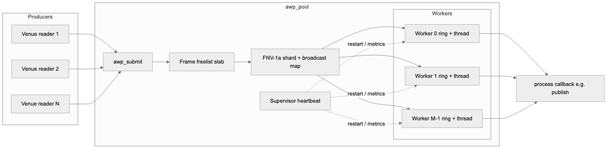
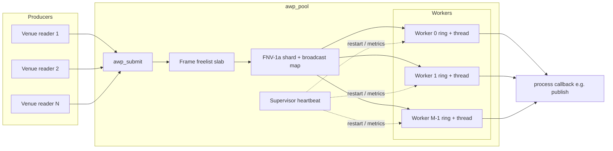
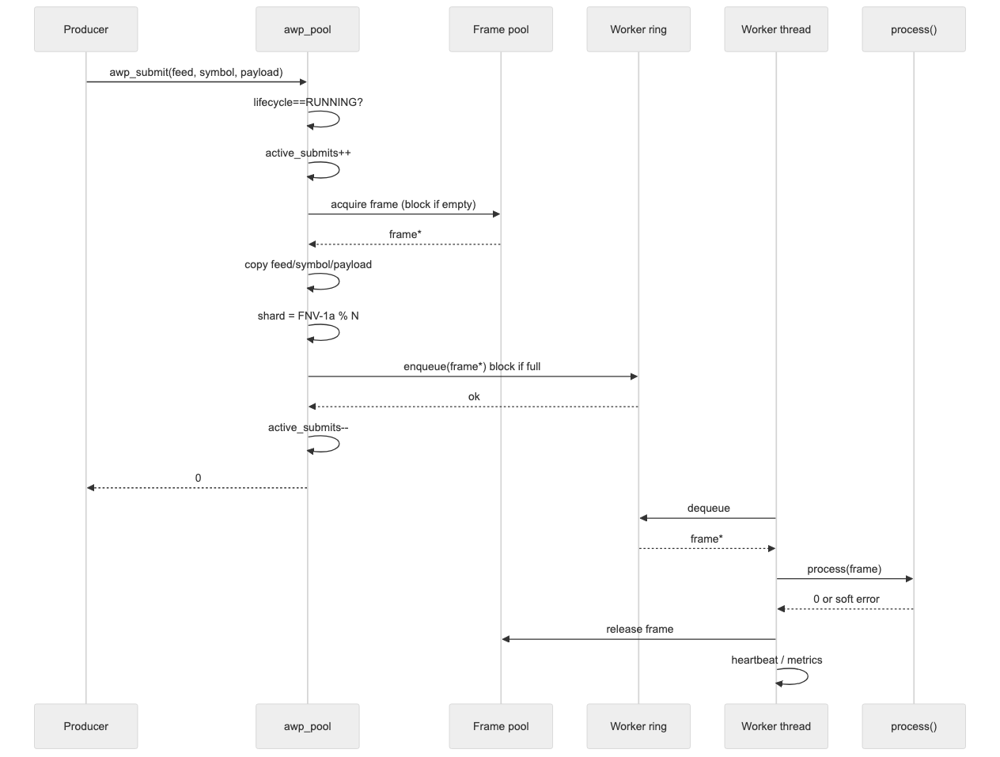
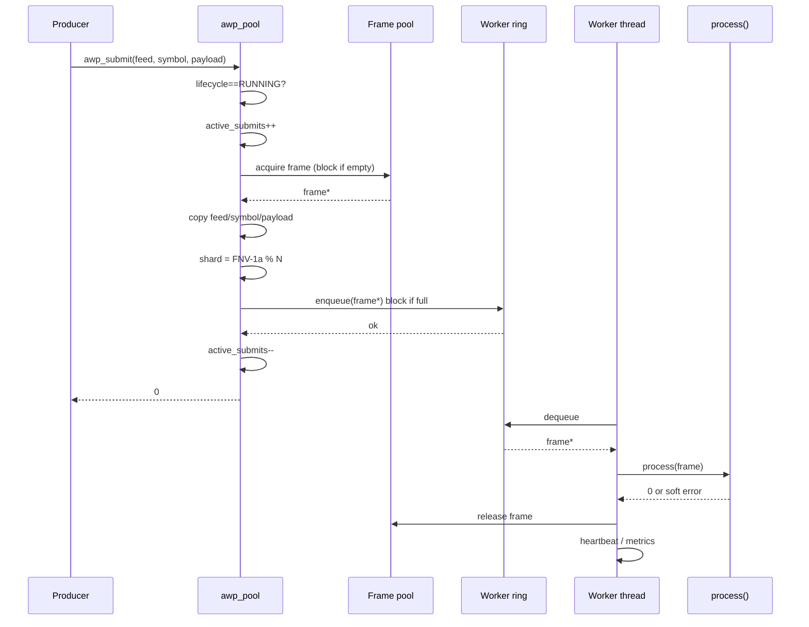
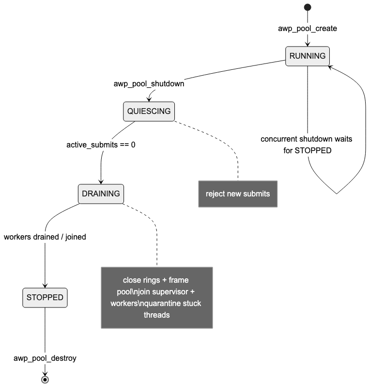
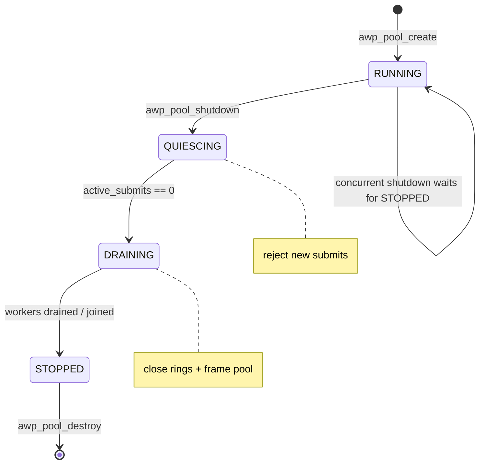
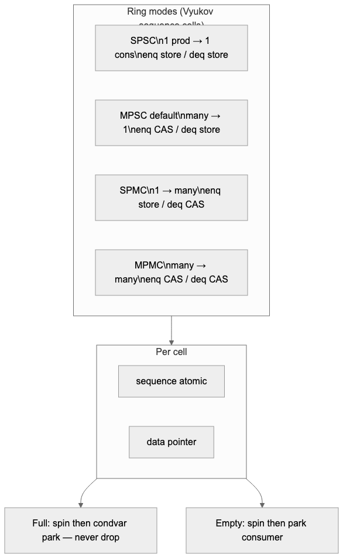
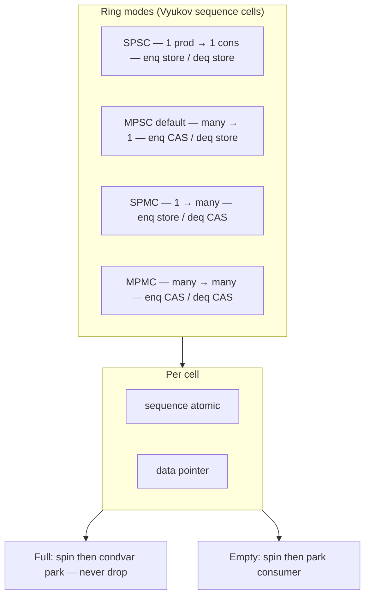
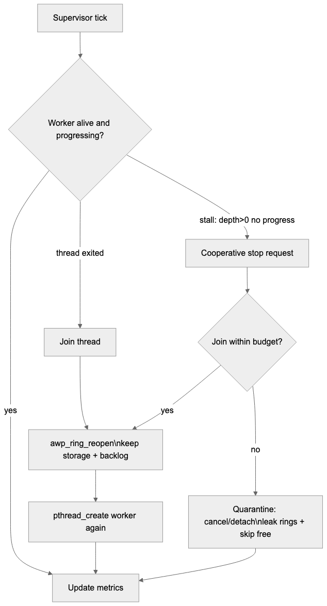
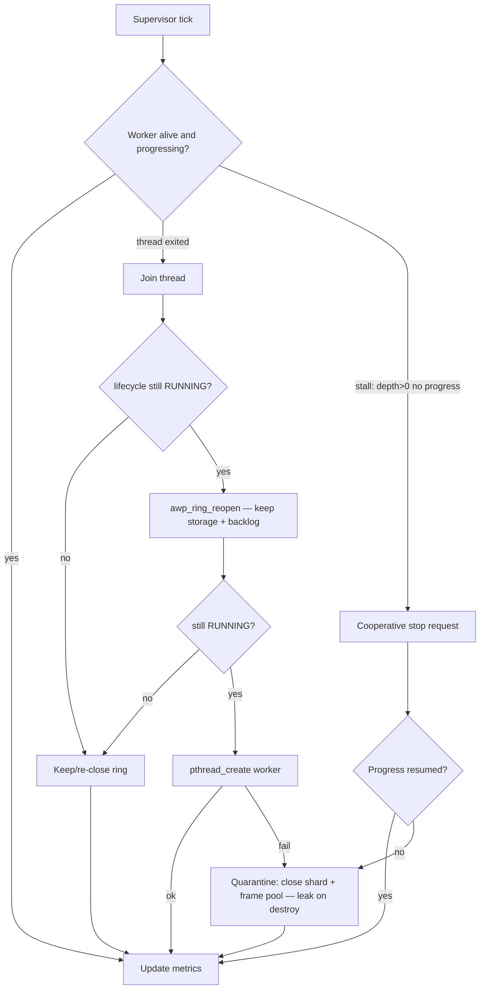

# Architecture diagrams

Rendered PNGs live in [`diagrams/`](diagrams/). Mermaid sources below also render on GitHub.

## 1. Pool architecture

## 2. Submit → process path

## 3. Lifecycle state machine

**States (post lifecycle S0 fixes):**

| State | Meaning |
|-------|---------|
| `RUNNING` | Accepts submits |
| `QUIESCING` | Rejects new work; waits for in-flight `active_submits` |
| `DRAINING` | Rings/pool closed; workers drain to empty; joins |
| `STOPPED` | Safe to destroy (or leak quarantined workers) |

## 4. Ring concurrency modes

Wrong mode for actual concurrency is **UB**. Pool default is **MPSC**.

## 5. Supervisor restart

Restart **reopens** the ring only while `RUNNING`; if shutdown wins mid-restart, the ring is **re-closed** so producers wake. Stuck callbacks are never cancelled/detached.

## Related docs

- [`DESIGN.md`](DESIGN.md) — full architecture write-up
- [`BENCHMARKS.md`](BENCHMARKS.md) — measured latency/throughput
- Historical S0/S1 dumps: local-only under `docs/archive/reviews/` if present (untracked)
